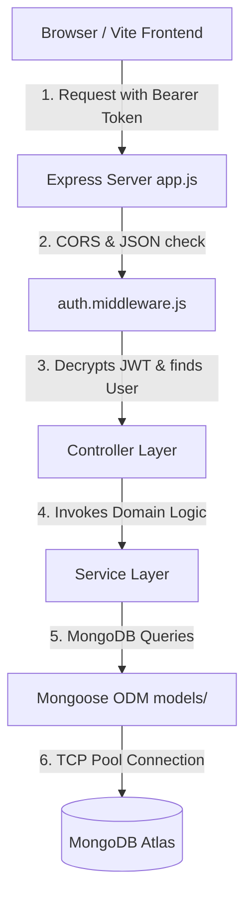
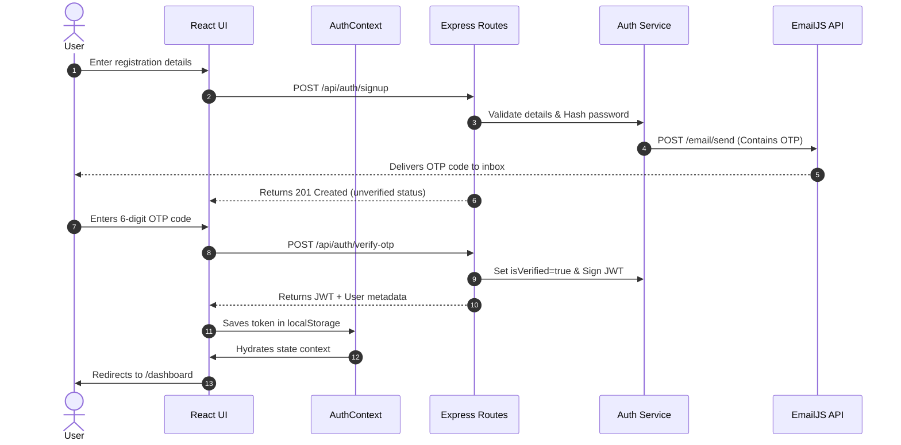

# TrackMyHunt

**TrackMyHunt** is a comprehensive job-hunt management platform designed to help students and developers organize their career journey. It provides a centralized dashboard to track applications, plan opportunities, manage skills, and store resources.


---

## 2. Overview

Navigating the modern tech job market is a complex task. Job seekers must coordinate dozens of application states across multiple sites, note specifications for different stages (Resume Screening, OA, Technical Interviews), practice technical target skills, and save reference guides. 

**TrackMyHunt** acts as a centralized dashboard and pipeline visualizer to track your job-hunt progress. This project operates as a standard three-tier MERN web application, providing:
*   **A central workspace** to log, update, and manage job applications.
*   **A dashboard visualizer** that aggregates metrics using MongoDB aggregation queries.
*   **Security features** including local credential hashing, dynamic OTP verification email workflows, and Google OAuth integrations.

---

## 3. Features

*   **📊 Dashboard**: Aggregates application metrics (Applied, OA, Scheduled, Rejected) using MongoDB aggregation pipelines, displaying key success rate statistics.
*   **💼 Application Tracker**: Complete CRUD pipeline logging job applications, matching job types (Intern, Full-Time, Remote, Freelance), and updating hiring stages.
*   **📅 Opportunity Planner**: Logs upcoming openings and dates.
*   **🎯 Skillboard**: Allows self-assessment of technical target skills.
*   **📚 Resources Hub**: Organizes quick-access reference URLs, course materials, and technical study guides.
*   **📝 Personal Notes**: Saves detailed records of interview experiences, key questions, and daily tasks.
*   **📄 Resume Manager**: Manages multiple version references and file share URLs.
*   **🔐 Two-Factor Email OTP verification**: Ensures new email sign-ups are verified before database accounts are activated.
*   **🌐 Google OAuth Auth**: Integration with Google Sign-in for immediate verification and sign-in.
*   **📱 Responsive Interface**: Custom layout rendering (Sidebar and Main Area) designed for desktop, tablet, and mobile views.

---

## 4. Tech Stack

| Domain | Technology / Library | Version | Description |
| :--- | :--- | :--- | :--- |
| **Frontend Core** | React (Vite) | `^19.1.1` | Single Page Application framework. |
| **Styling** | Tailwind CSS | `^4.1.16` | Utility-first styling engine. |
| **Icons** | Lucide React | `^0.552.0` | SVG icons pack. |
| **Routing** | React Router Dom | `^7.9.5` | Client-side routing engine. |
| **OAuth** | @react-oauth/google | `^0.13.4` | Google Sign-in integration. |
| **Backend Core** | Express | `^5.2.1` | REST API micro-framework. |
| **Database** | MongoDB & Mongoose | `^9.1.5` | Document-oriented database & Object Document Mapper. |
| **Authentication**| JSON Web Token | `^9.0.3` | HMAC SHA256 stateless session management. |
| **Pass Hashing** | Bcrypt | `^6.0.0` | Cryptographic credential hashing library. |
| **HTTP Client** | Axios | `^1.13.2` | Backend requests dispatcher (EmailJS). |
| **Email Gateway** | EmailJS REST API | - | External email gateway service. |
| **Configuration** | Dotenv | `^17.2.3` | Environment variable loader. |

---

## 5. Architecture



### Request Flow
1. **Request Dispatch**: The user triggers an action in the React view. The API layer [frontend/src/services/api.js](file:///b:/TrackMyHunt/frontend/src/services/api.js) sends a request containing JSON payload and JWT credentials in the `Authorization: Bearer <token>` header.
2. **Express Routing**: [backend/app.js](file:///b:/TrackMyHunt/backend/app.js) matches the endpoint path prefix.
3. **Route Gatekeepers**: [backend/middleware/auth.middleware.js](file:///b:/TrackMyHunt/backend/middleware/auth.middleware.js) intercepts the request, verifies the signature using `jwt.verify()`, and attaches the parsed user document to `req.user`.
4. **Controller Orchestration**: The controller parses inputs (parameters, query arguments, body) and calls the service layer.
5. **Business Logic Execution**: The service files (e.g., `services/application.service.js`) run queries against MongoDB via Mongoose Models.
6. **Response Cycle**: The controller sends a JSON response back to the client, which updates the React state context, triggering a clean interface re-render.

---

## 6. Folder Structure

```
TrackMyHunt/
├── backend/                  # Node.js/Express.js Backend REST API
│   ├── config/               # Database initialization & connections
│   │   └── database.js       # Mongoose Atlas connection pool config
│   ├── controllers/          # HTTP controllers mapping request-response lifecycles
│   │   ├── application.contoller.js  # Job applications CRUD handlers
│   │   ├── auth.controller.js        # Authentication & password management
│   │   └── dashboard.controller.js   # Analytics pipeline stats logic
│   ├── middleware/           # Pipeline checks
│   │   └── auth.middleware.js        # Token verification & request user injector
│   ├── models/               # Mongoose schema validator definitions
│   │   ├── application.models.js     # Ref User schema relationships
│   │   └── user.model.js             # User properties, sparse Google indexes
│   ├── routes/               # Modular API endpoint registries
│   │   ├── application.routes.js     # Protected application endpoints
│   │   └── auth.routes.js            # Public auth routes (signup, reset, OAuth)
│   ├── services/             # Pure stateless business logic layer
│   │   ├── auth.service.js           # Password resets, token signing logic
│   │   └── mail.services.js          # EmailJS REST client wrapper integrations
│   ├── app.js                # Express app setup, CORS logic, global middlewares
│   └── server.js             # Port listener, initialization bootstrap entry point
│
├── frontend/                 # Vite / React.js Client Application
│   ├── src/
│   │   ├── components/       # Interface units
│   │   │   ├── auth/         # Login forms & AuthOverlay layouts
│   │   │   └── layout/       # ProtectedLayout frames, Sidebar & Navbar
│   │   ├── context/          # State providers
│   │   │   └── AuthContext.jsx       # Persisted session context management
│   │   ├── pages/            # Core views (Dashboard, Resumes, Skillboard)
│   │   └── services/         # Client API dispatcher gateway
│   │       └── api.js        # Custom fetch wrapper with dynamic auth headers
```

---

## 7. Installation

### Prerequisites
*   **Node.js** (v18 or higher recommended)
*   **MongoDB Atlas Cluster** (or local Mongo installation)
*   **Google OAuth Credentials** (Client ID from Google Cloud Console)
*   **EmailJS Account** (Service ID, template keys, and private REST access token)

### Step-by-Step Setup

1. **Clone the Repository**
   ```bash
   git clone https://github.com/ayushkhandelwal18/TrackMyHunt.git
   cd TrackMyHunt
   ```

2. **Configure the Backend**
   ```bash
   cd backend
   npm install
   ```
   Create a `.env` file in the [backend/](file:///b:/TrackMyHunt/backend) directory:
   ```env
   PORT=3000
   DATABASE_URL=your_mongodb_atlas_connection_string
   JWT_SECRET=your_secret_hash_key
   CLIENT_URL=http://localhost:5173
   GOOGLE_CLIENT_ID=your_google_oauth_client_id
   EMAILJS_SERVICE_ID=your_emailjs_service_id
   EMAILJS_TEMPLATE_ID=your_emailjs_otp_template_id
   EMAILJS_WELCOME_TEMPLATE_ID=your_emailjs_welcome_template_id
   EMAILJS_PUBLIC_KEY=your_emailjs_public_key
   EMAILJS_PRIVATE_KEY=your_emailjs_private_key
   ```
   Start the backend in development (auto-reload) mode:
   ```bash
   npm run dev
   ```

3. **Configure the Frontend**
   ```bash
   cd ../frontend
   npm install
   ```
   Create a `.env` file in the [frontend/](file:///b:/TrackMyHunt/frontend) directory:
   ```env
   VITE_GOOGLE_CLIENT_ID=your_google_oauth_client_id
   VITE_BASE_BACKEND_URL=http://localhost:3000
   ```
   Start the frontend application:
   ```bash
   npm run dev
   ```

---

## 8. Environment Variables

### Backend Configuration

| Variable | Description | Required? |
| :--- | :--- | :--- |
| `PORT` | The port the Node.js server binds to (defaults to `5000` if not set). | No |
| `DATABASE_URL` | MongoDB connection URL (including credentials). | **Yes** |
| `JWT_SECRET` | Secret key used to sign and verify stateless session JWTs. | **Yes** |
| `CLIENT_URL` | The origin URL of the React client (used by CORS policy validations). | **Yes** |
| `GOOGLE_CLIENT_ID` | OAuth Client ID used by the backend to verify tokens from Google. | **Yes** |
| `EMAILJS_SERVICE_ID` | EmailJS service identifier used for sending emails. | **Yes** |
| `EMAILJS_TEMPLATE_ID` | EmailJS template ID for verification and reset OTP emails. | **Yes** |
| `EMAILJS_WELCOME_TEMPLATE_ID` | EmailJS template ID for welcome emails. | No |
| `EMAILJS_PUBLIC_KEY` | Account-level public key from EmailJS dashboard. | **Yes** |
| `EMAILJS_PRIVATE_KEY` | Account private key used to authorize backend REST API calls. | **Yes** |

### Frontend Configuration

| Variable | Description | Required? |
| :--- | :--- | :--- |
| `VITE_GOOGLE_CLIENT_ID` | Google Client ID loaded by the `@react-oauth/google` provider. | **Yes** |
| `VITE_BASE_BACKEND_URL` | Base endpoint URL of the Express API (e.g. `http://localhost:3000`). | **Yes** |

---

## 9. Authentication Flow

Authentication is managed via stateless JWT tokens and verified emails:



### Authentication Subsystems

1.  **Email & Password Signup**:
    Passwords are hashed with **bcrypt (10 rounds)**. An account is created in MongoDB with `isVerified: false`. A 6-digit OTP is generated and sent to the user's email.
2.  **Email Verification (OTP)**:
    When the user submits the correct OTP, the database updates the record to `isVerified: true`, signs a JWT containing the user ID, and returns it to the client.
3.  **Google OAuth Integration**:
    The client logs in via Google and sends the ID token to `POST /api/auth/google`. The backend validates the signature using `google-auth-library`. If it is a new user, it creates an account, skips OTP verification, signs a **30-day JWT**, and returns it to the client.
4.  **Token Verification (Middlewares)**:
    Subsequent API calls attach the token to the header: `Authorization: Bearer <token>`. The backend validates the signature. If valid, the user context is loaded into memory (`req.user`) to handle the request.

---

## 10. API Documentation

All request payloads and responses use standard JSON format.

### Authentication Endpoints (`/api/auth`)

| Method | Endpoint | Description | Auth Required? | Request Body | Success Response |
| :--- | :--- | :--- | :--- | :--- | :--- |
| `POST` | `/api/auth/signup` | Registers new user, hashes password, and sends verification OTP. | No | `{ name, email, password }` | `{ message: "Signup successful. Verify OTP.", data: { email } }` |
| `POST` | `/api/auth/verify-otp` | Validates signup OTP code and returns session JWT. | No | `{ email, otp }` | `{ message: "Account verified", token, user: { name, email } }` |
| `POST` | `/api/auth/login` | Authenticates credentials and returns session JWT. | No | `{ email, password }` | `{ message: "Login successful", token, user: { name, email } }` |
| `POST` | `/api/auth/google` | Validates Google ID token and returns session JWT. | No | `{ token }` | `{ success: true, token, user: { id, name, email, verificationStatus, avatar } }` |
| `POST` | `/api/auth/resend-otp` | Generates and resends a new verification OTP. | No | `{ email }` | `{ email, message: "OTP resent successfully" }` |
| `POST` | `/api/auth/forgot-password` | Generates a password reset OTP and sends it via email. | No | `{ email }` | `{ message: "If an account with this email exists, an OTP has been sent." }` |
| `POST` | `/api/auth/reset-password` | Resets password if reset OTP matches. | No | `{ email, otp, newPassword }` | `{ message: "Password reset successfully" }` |

### User Profile Endpoints (`/api/user`)

| Method | Endpoint | Description | Auth Required? | Request Body | Success Response |
| :--- | :--- | :--- | :--- | :--- | :--- |
| `PUT` | `/api/user/profile` | Updates user details (name). | **Yes** | `{ name }` | `{ message: "Profile updated successfully", user: { name, email } }` |
| `PUT` | `/api/user/password` | Changes user password. | **Yes** | `{ currentPassword, newPassword }` | `{ message: "Password changed successfully" }` |
| `DELETE` | `/api/user/account` | Permanently deletes user account and all their records. | **Yes** | `{ password }` | `{ message: "Account deleted successfully" }` |

### Application Endpoints (`/api/applications`)

| Method | Endpoint | Description | Auth Required? | Request Body | Success Response |
| :--- | :--- | :--- | :--- | :--- | :--- |
| `GET` | `/api/applications` | Fetches all job applications for the logged-in user. | **Yes** | None | `[ { _id, company, role, type, status, appliedDate } ]` |
| `POST` | `/api/applications` | Logs a new job application. | **Yes** | `{ company, role, type, status, appliedDate, notes, applicationLink }` | Newly created application object. |
| `PUT` | `/api/applications/:id` | Modifies details of a specific job application. | **Yes** | `{ company, status, ... }` | Updated application object. |
| `DELETE` | `/api/applications/:id` | Deletes a specific job application. | **Yes** | None | `{ message: "Application deleted" }` |

*Note: The endpoints for `opportunities`, `skills`, `resources`, `notes`, and `resumes` follow the same standard protected REST pattern.*

---

## 11. Project Workflow

1.  **Registration**:
    *   The user goes to the landing page and registers with their name, email, and password.
    *   The backend saves their details (unverified status) and emails them a verification OTP.
2.  **Email Verification**:
    *   The user inputs the OTP code. Once verified, the user is automatically logged in and redirected to `/dashboard`.
3.  **Logging an Application**:
    *   Navigate to the **Applications** page, click "Add Application", input the company name, role (e.g. Intern, Full-Time), date, and current status (e.g. Applied), and save.
4.  **Managing Skills**:
    *   Navigate to the **Skillboard** page to list current technologies and identify gaps relative to target roles.
5.  **Monitoring Metrics**:
    *   The **Dashboard** page dynamically updates to display statistics on application counts, interview conversion rates, and skill metrics.

---

## 12. Request Lifecycle

```
1. Client browser triggers a state change (e.g. User submits a new job application).
   │
   ▼
2. api.js retrieves the JWT token from localStorage and makes a POST call using fetch.
   │
   ▼
3. Express server (app.js) parses CORS origins and decodes the JSON request body.
   │
   ▼
4. auth.middleware.js extracts the Bearer token, validates it, and fetches req.user.
   │
   ▼
5. The request router passes execution to application.controller.js.
   │
   ▼
6. Controller calls applicationService.createApplication(req.user._id, req.body).
   │
   ▼
7. The service executes an Application.create() query using Mongoose.
   │
   ▼
8. MongoDB updates the collection and returns the written document.
   │
   ▼
9. Express controller returns the JSON payload response back to the client.
   │
   ▼
10. The React client context resolves the API call, updates state, and re-renders the UI.
```

---

## 13. Security

### Implemented Security Measures
*   **Stateless Authentication (JWT)**: Users are validated using signed JSON Web Tokens, protecting routes from unauthorized access.
*   **Password Hashing**: User passwords are saved as secure hashes using **bcrypt** with **10 salt rounds**, mitigating dictionary and rainbow table database leaks.
*   **Secure Google OAuth Token Verification**: Rather than trusting client claims, the backend verifies Google ID tokens using the official Google OAuth library.
*   **CORS Whitelist Restriction**: [backend/app.js](file:///b:/TrackMyHunt/backend/app.js) limits requests to trusted domains (like localhost and Vercel hosting origins) to block unauthorized cross-origin calls.
*   **Strict Database Scoping**: Application modifications are scoped using both the target resource ID and the logged-in user's ID (`req.user._id`), preventing ID-guessing access vulnerabilities.
*   **MongoDB Sparse Unique Index**: A sparse index on `googleId` enforces uniqueness while allowing standard email users (who lack a `googleId`) to register without database collision errors.

### Missing Security Enhancements (Recommended for Production)
*   **XSS Protection**: Change token storage from client-side `localStorage` to secure, **`httpOnly` cookies**.
*   **Rate Limiting**: Protect authentication endpoints (login, forgot-password) from brute-force scripts using rate limiters like `express-rate-limit`.
*   **Security Header Configuration**: Mount the `helmet` middleware in Express to configure secure HTTP headers (e.g. Content Security Policies).
*   **Input Sanitization**: Sanitize request payloads (using libraries like `express-validator` and `xss-clean`) to prevent NoSQL injection and HTML injection attacks.

---

## 14. Email System (EmailJS Integration)

This application uses the **EmailJS REST API** instead of local SMTP servers (like Nodemailer) to manage and send emails.

### Why EmailJS?
1.  **No Local Mail Server Required**: Offloads email handling to a managed third-party service, avoiding mail routing issues and keeping server dependencies light.
2.  **Visual Templates**: Emails are configured visually using the EmailJS editor dashboard, allowing changes to email layouts without modifying backend code.
3.  **Backend Integration**: Rather than using the EmailJS client-side SDK (which exposes service keys in the browser), TrackMyHunt calls the EmailJS REST API from the backend, keeping private access tokens secure.

### Email Configuration & Workflows

```
[ Backend Auth Event ] ──> [ Generate 6-Digit OTP ]
                                    │
                                    ▼
[ EmailJS REST API ]   <──  [ Send HTTP POST request with service keys ]
                                    │
                                    ▼
[ User's Inbox ]       <──  [ Delivers OTP / Welcome template ]
```

1.  **OTP Email Dispatch (`sendOTPEmail`)**:
    *   Triggered during user signup or password reset flows inside [auth.service.js](file:///b:/TrackMyHunt/backend/services/auth.service.js).
    *   Calls the private REST endpoint: `https://api.emailjs.com/api/v1.0/email/send`.
    *   **Template Parameters**: Passes `otp`, `type` ("Account Verification" or "Password Reset"), and `subject` matching the template requirements.
2.  **Welcome Email Dispatch (`sendWelcomeEmail`)**:
    *   Triggered immediately after a user verifies their account.
    *   Sends a welcome template using the recipient's name: `{ user_name: name }`.

### Verification & Environment Configuration
To set up the EmailJS service:
1.  Register on [EmailJS](https://www.emailjs.com/).
2.  Add an Email Service (e.g. Gmail) and copy the `Service ID`.
3.  Create two email templates (one for OTPs and one for Welcome emails). Use template variables: `{{otp}}`, `{{type}}`, `{{subject}}`, and `{{user_name}}`.
4.  Copy the template IDs, account Public Key, and Private Key from the Account Settings dashboard, and add them to your backend `.env` variables:
    *   `EMAILJS_SERVICE_ID`
    *   `EMAILJS_TEMPLATE_ID`
    *   `EMAILJS_WELCOME_TEMPLATE_ID`
    *   `EMAILJS_PUBLIC_KEY`
    *   `EMAILJS_PRIVATE_KEY` (Required to authorize backend API requests).

---

## 15. Deployment

### Frontend (Vercel)
Vite applications deploy natively on Vercel. 
Configure a `vercel.json` rewrite file to ensure route requests are routed correctly to `index.html` for client-side routing:
```json
{
  "rewrites": [
    { "source": "/(.*)", "destination": "/index.html" }
  ]
}
```

### Backend (Render, Railway, or Heroku)
1.  Deploy the backend directory as an Express service.
2.  Add your environment variables (`DATABASE_URL`, `JWT_SECRET`, `EMAILJS_PRIVATE_KEY`, etc.) inside the hosting provider's dashboard dashboard.
3.  Set the start command to:
    ```bash
    npm start
    ```

### Database (MongoDB Atlas)
1.  Set up a free tier MongoDB Atlas shared cluster.
2.  Add your backend server's IP address to the Atlas Network Access Whitelist (or set access to `0.0.0.0/0` for dynamic cloud IPs).
3.  Copy the connection string, replace the placeholder password, and assign it to the `DATABASE_URL` environment variable.

---

## 16. Future Improvements

*   **HTTP-Only Session Cookies**: Move JWT storage to secure HTTP-only cookies to protect sessions from XSS attacks.
*   **Express Rate Limiting**: Secure endpoints (like `/api/auth/login`) against brute-force attacks.
*   **Centralized Frontend Error Interceptors**: Refactor the frontend HTTP wrapper to catch 401 errors, clear session state, and redirect expired user sessions automatically.
*   **Request Validation Schemas**: Use `express-validator` to define schemas and validate incoming requests before they reach controllers.
*   **Server-Side Logout Blacklisting**: Integrate an in-memory database (like Redis) to blacklist JWTs on logout, blocking access if a logged-out token is used before it expires.
*   **Token Rotation**: Implement short-lived Access Tokens paired with secure Refresh Tokens.

---

## 17. Contributing

Contributions are welcome! Please follow these steps to contribute:

1.  **Fork the Repository**
2.  **Create a Feature Branch**
    ```bash
    git checkout -b feature/your-awesome-feature
    ```
3.  **Commit your Changes**
    ```bash
    git commit -m "feat: Add some awesome feature"
    ```
4.  **Push to your Branch**
    ```bash
    git push origin feature/your-awesome-feature
    ```
5.  **Submit a Pull Request** to the main branch for review.

---

## 18. Contact

*   **GitHub**: [@ayushkhandelwal18](https://github.com/ayushkhandelwal18)
*   **Email**: ayushdev186@gmail.com


---
*Created by [Ayush Khandelwal](https://github.com/ayushkhandelwal18)*
